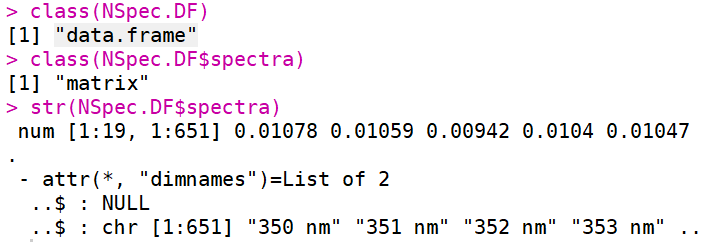
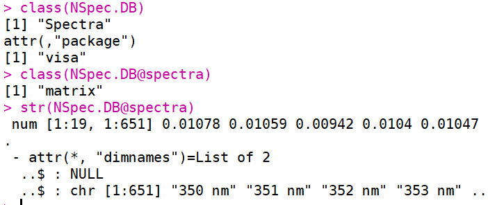

```{r setup, include = FALSE}
knitr::opts_chunk$set(
  collapse = TRUE,
  comment = "#>"
)
```

Imaging Spectroscopy (also known as Hyperspectral Remote Sensing, HRS) technology and data are increasingly used in environmental sciences, and nowadays much more beyond that, thus requiring accessible data and analytical tools (especially open source) for students and scientists with a diverse background. Therefore, I come up with such a idea since i was a PhD student at the University of Cologne, inspired by the growing community of R and R users. I have been mainly working with spectral data of plants, and that is reason i use the name VISA for this package, with the aim to facilitate the use of imaging spectroscopy techniques and data for the extraction of vegetation signatures for plant stresses and biodiversity.

Future development of this tool has a long-term goal to include: i) implement the state-of-the-art applications of vegetation spectral indicators, ii) provide a platform to share vegetation spectral data to address certain questions of interest or applications in a broad context, and iii) make it compatible with more data formats and tools, such as the r package hsdar^[ Lukas W. Lehnert, Hanna Meyer, Joerg Bendix (2018). hsdar: Manage, analyse and simulate hyperspectral data in R].

Currently, `visa` can be installed via my [GitHub repository visa](https://github.com/kang-yu/visa), by `devtools::install_github("kang-yu/visa")`, and its submission to CRAN is in progress. This vignette will introduces the design and features of `visa` from the following aspects:

- Data
- Functions 
- Compatibility 


## Data 

The `visa` package intends to simplify the use and reduce the limit of data format and structure. `visa` uses two data formats, and a hacking use of R's `data.frame` and, a S4^[The S4 object system http://adv-r.had.co.nz/S4.html] class specifically for `visa`.

### Built on `data.frame`

Why i call it a hacking use is because a data.frame is a table organized by variables, and it is ideal to store every spectral band in as a variable. Imaging that you have thousands of columns and you have to refer to thousands of bands when using data.frame. Then, why not just store all the spectral bands, ie. the spectral matrix in a single variable, like the example data `NSpec.DF`. 

This will be ease your coding for analysis, and you write your argument as '*y ~ spectra*' instead of '*y ~ band1 + band2 + band3 + ... *' 
```
# check the data type of `NSpec.DF`
class(NSpec.DF) 
class(NSpec.DF$spectra) 
```


### S4 class `Spectra` and `SpectraDatabase`

There are already a lot of r packages for spectral data analysis, and some of them use the S4 class, e.g. the `hsdar` package. `visa` also supports the S4 format but in a simplified version, using only five slots currently. 

```
# check the data type of `NSpec.Lib`
class(NSpec.Lib) 
class(NSpec.Lib@spectra) 
```


Notice that the small difference of accessing data in two types of data, i.e., using `$` and `@`, respectively.  

## Functions 
### Computing correlation matrix

The first idea of writing this package was to compute the correlation matrix for the thorough analysis of correlations between, on one hand, the combinations of spectral bands, and on the other hand, the vegetation variables of interest. 

Here gives the example using the `cm.nsr` function, which can be used for non-spectra data as well.

```{r, echo=TRUE, warning=FALSE}
library(visa)
data(NSpec.DF)
x <- NSpec.DF$N # nitrogen
S <- NSpec.DF$spectra[, seq(1, ncol(NSpec.DF$spectra), 10)] # resampled to 10 nm steps
cm <- cm.nsr(S, x, cm.plot = TRUE)
```


### Plotting correlation matrix

The correlation matrix plot is the plot of correlation coefficients (r/r2) by bands in x- and y-axis. 

```{r, fig.show='hold', fig.cap = "Plot of correlation matrix"}
# use the output from last example
# cm <- cm.nsr(S, x)
# Plotting the correlation matrix
#ggplot.cm(cm)

plot.2dcm(cm) # new function replacing ggplot.cm

```


#### More Examples and Details

The computation of SR and NSR follow the equations, e.g.:

$SR = \lambda_i / \lambda_j$

$NSR = (\lambda_i - \lambda_j)/(\lambda_i + \lambda_j)$

To know more about the NDVI, please also check on Wikipedia^[Normalized difference vegetation index (https://en.wikipedia.org/wiki/Normalized_difference_vegetation_index)].


#### Example data `NSpec.Lib`

 The first type is the 'NSpec.Lib' in the default S4 class 'Spectra'.

```{r, echo=TRUE, results='asis'}
library(visa)
# check the data type
class(NSpec.Lib) 
# data structure
# str(NSpec.Lib)
# print the first 10 columns
knitr::kable(head(NSpec.Lib@spectra[,1:10]))
```

#### Example data `NSpec.DF`

The second type is a data.frame format, i.e., `NSpec.DF`.

```{r, echo=TRUE, results='asis'}
# check the data type
class(NSpec.DF) 
# check whether it contains the same data as 'NSpec.Lib'
knitr::kable(head(NSpec.DF$spectra[,1:10]))
```

#### Accessing data 

`spectra`

`wavelength`

## Compatibility
### Data format conversion

`as.spectra`

`as.spectra.data.frame`


### Future development
Regarding compatibility for future development, special focuses will be put on:

- spatial data integration
- image analysis
- deep learning


